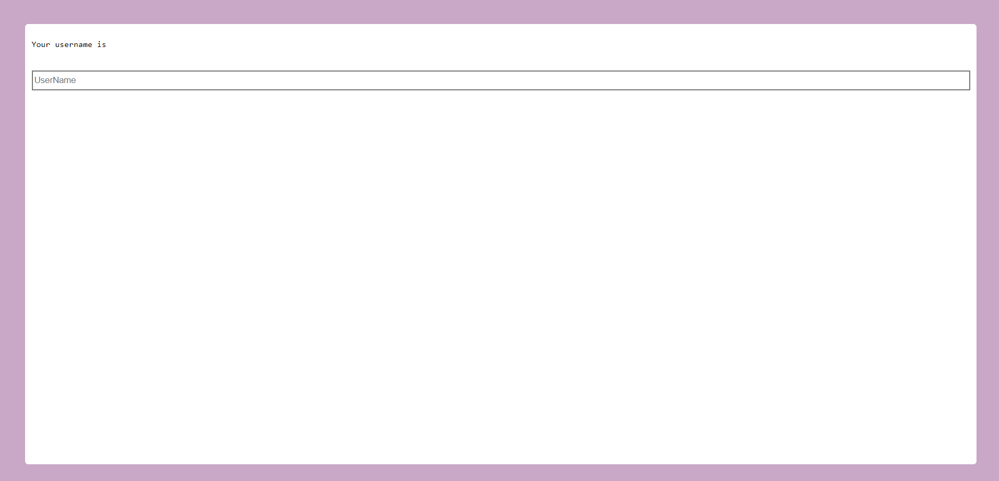

# Fluttered.JS

A Flutter inspired JavaScript Library

Hecho en 🇵🇷 por Radamés J. Valentín Reyes

## Example Fluttered.js app

This example demonstrates the capability to update the values in Text widgets.

A normal html skeleton referencing the fluttered.js 

### fluttered.html

~~~html
<!DOCTYPE html>
<html>
  <head>
    <meta charset="UTF-8"/>
    <meta name="viewport" content="width=device-width, initial-scale=1.0">
    <!--Fluttered js library below-->
    
    <!--Created file containing the UI-->
    
  </head>
  <body>
    
  </body>
</html>
~~~

### testFlut.js

~~~javascript
Scaffold({
  body: Expanded({
    child: Container({
      padding: 40,
      color: '#C8A7C7',
      child: Column({
        backgroundColor: 'white',
        padding: 10,
        borderRadius: 5,
        children:[
          Text({
            text: 'Your username is {{myUserName}}',
          }),
          SizedBox({
            height: 20,
          }),
          Expanded({
            child: InputField({
              height: 30,
              placeholder: 'UserName',
              onChange: (newValue)=>{
                flutteredGlobal.setValue('myUserName',newValue);
              },
            }),
          }),
        ],
      }),
    }),
  }),
});
~~~

## Result:

